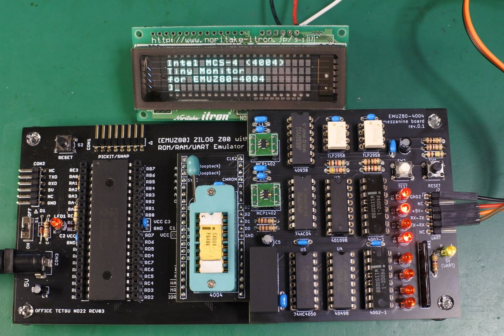

# EMUZ80-4004
4004 mezzanine board for EMUZ80

This document is written mostly in Japanese. If necessary, please use a translation service such as DeepL (I recommend this) or Google.

## 概要
電脳伝説さん(@vintagechips)のEMUZ80( https://github.com/vintagechips/emuz80 )のZ80をIntel4004に差し替えるための基板,PIC用ファームウェア，4004用のデモプログラム(電卓)です．

## このレポジトリの内容
- hardware/rev0.1 KiCad 7用のファイル一式
- src/PIC/emuz80_4004.X MPLAB IDE用のプロジェクトフォルダ
- src/demo/calc 電卓のデモプログラム

## 動画
Youtubeで関連動画を公開しています．
- https://www.youtube.com/@ryomukai/videos

## ブログ
関連する情報が書いてあるかも．
- [Intel 4004 関連記事の目次@ブログの練習](https://blog.goo.ne.jp/tk-80/e/3fa1e2972737c7b7d1b83f4e7bd648a2)

## 開発環境
- [The Macroassembler AS](http://john.ccac.rwth-aachen.de:8000/as/)
- [Microchip MPLAB IDE](https://www.microchip.com/en-us/tools-resources/develop/mplab-x-ide)

## 更新履歴
- 2023/5/23: 初版公開
